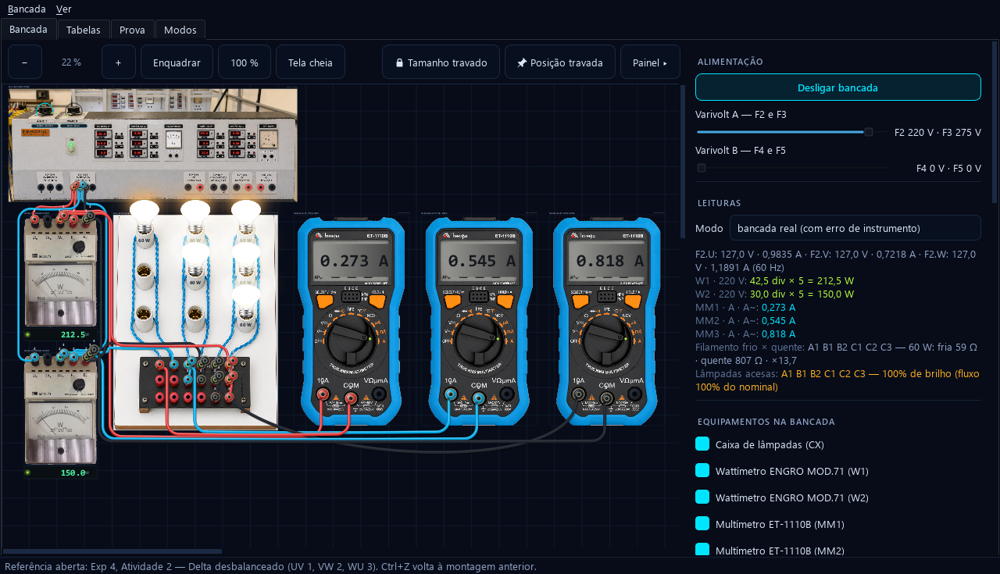
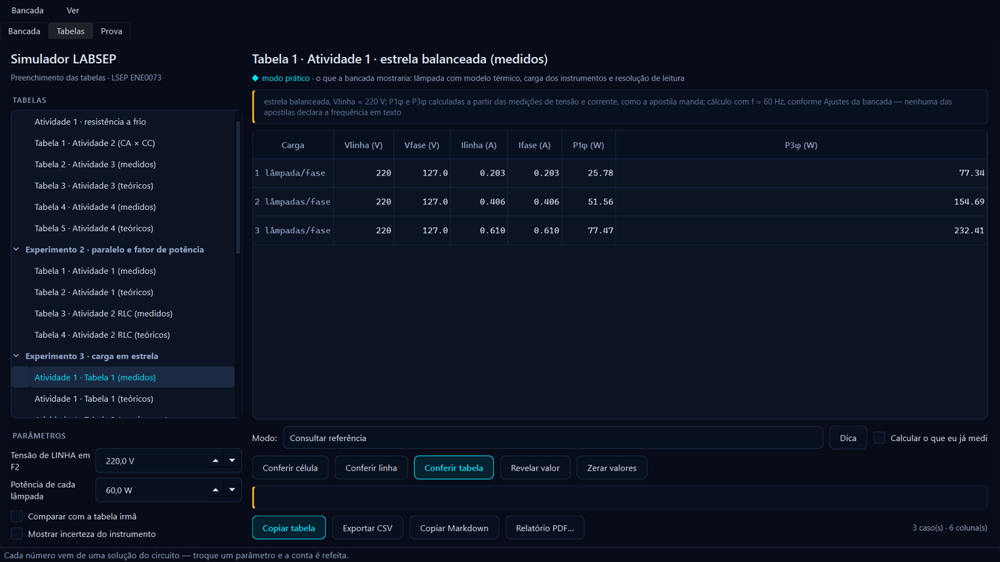
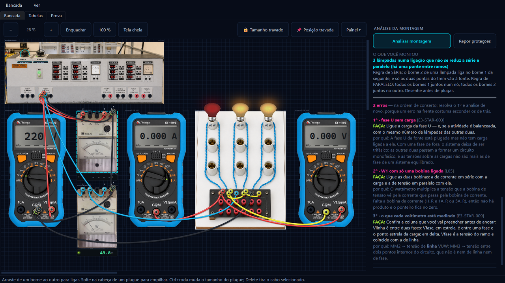
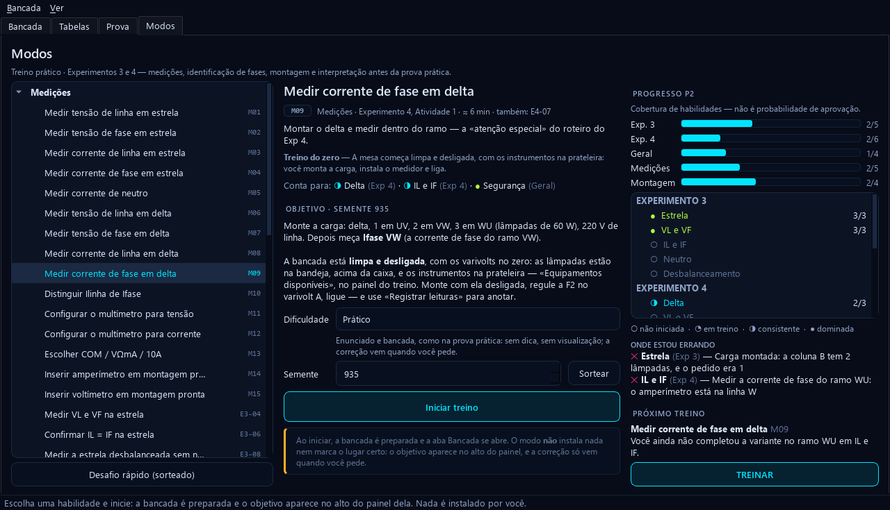

# Simulador LABSEP

A bancada do **Laboratório de Sistemas de Energia Elétrica (ENE0073)** na sua
máquina: os mesmos equipamentos, os mesmos bornes, os mesmos instrumentos — e
os cabos você pluga um a um, como faz na aula.



**[⬇ Baixar a última versão](../../releases/latest)** · Windows 64 bits · não
pede administrador · funciona sem internet

**Novo na 1.18.0:** a aba **Modos** refeita — 35 dos 71 modos começam com a
bancada vazia e os instrumentos numa prateleira, as montagens dos roteiros
viram referência para comparar com a sua, e os cabos das montagens prontas
passam pelos corredores entre os aparelhos — [o que mudou](../../releases/tag/v1.18.0).

---

## Por que isso existe

A prova prática é numa bancada só, com o tempo contado e o roteiro na mão.
Quem chega sem ter montado antes gasta metade da aula descobrindo onde vai o
amperímetro — e a outra metade desconfiando do número que leu. Aqui dá para
errar à vontade, na véspera, de madrugada, quantas vezes precisar.

Foi feito por um aluno da disciplina, para a turma da disciplina.

## O que dá para fazer

**Montar.** Arraste de um borne a outro para ligar um cabo. Empilhe plugues na
traseira de outro plugue, que é como se faz um nó de três na bancada de
verdade. Escolha a cor do fio, a potência de cada lâmpada, a posição de cada
chave. Nada é "aproximadamente": o que não pode ser ligado não liga, e o que
pode dá exatamente o que daria na mesa.

**Ou partir da figura pronta.** São **21 montagens** dos roteiros, armadas
cabo por cabo como o desenho manda — estrela, delta, equilibrado,
desequilibrado, neutro aterrado, correção de fator de potência, os
transformadores. Serve para estudar a figura e serve para conferir a sua
própria montagem contra ela. Nas dos Experimentos 3 e 4, os aparelhos ficam na
ordem de leitura da figura, sem um cobrir o outro, e os cabos passam pelos vãos
entre eles em vez de por cima de visor, mostrador ou bocal.

**Medir.** Os multímetros são ET-1110B com as faixas do manual: a leitura sai
com a resolução da faixa, mostra `OL` quando estoura e tem a incerteza
declarada. Os wattímetros ENGRO MOD.71 têm o ponteiro, o comutador e o
multiplicador — inclusive o ponteiro parado no batente quando a potência é
negativa, que é o que se vê antes de inverter a bobina. E a chave manda no que
o visor mostra: em V⎓ numa bancada CA ele marca zero — a média de uma senoide
—, e em CC a ponta trocada lê negativo.

**Descobrir onde o instrumento entra.** Botão direito num cabo e o programa diz
qual corrente passa ali com o nome da coluna da tabela: *a corrente de linha da
fase V*, *a corrente de fase do ramo UV*, *a corrente de neutro*. Escolhida uma,
ele abre o cabo e põe o amperímetro em série — que é a manobra que todo mundo
erra na primeira vez —, e mostra o gesto inteiro: a ponta sai do borne, o
aparelho chega, o COM e o 10A encaixam. Voltímetro é pelo borne, e entra em
paralelo sem desfazer nada.

**Preencher as tabelas do relatório.** As **46 tabelas** dos roteiros dos
Experimentos 1 a 7 estão no programa, com dica, conferência célula a célula,
valor revelado quando você desistir e exportação em CSV, Markdown ou PDF.



**Saber o que está errado antes de valer nota.** «Analisar montagem» percorre o
circuito e devolve o que fazer, por quê, e em que ordem consertar — são **62
achados** catalogados, cada um com código. No exemplo abaixo faltava a ligação
do amperímetro: a fase U ficou sem carga (a lâmpada apagada, à esquerda) e o
wattímetro ficou com uma bobina só.



**Treinar para a prova dos Experimentos 3 e 4.** A aba *Modos* traz **71
exercícios de bancada** em oito grupos — medições, identificação das fases,
montagens, wattímetros, fator de potência, diagnóstico, tabelas e um simulado
da P2. Treinar é montar: 35 deles começam com a bancada limpa e desligada —
varivolts no zero, nenhum cabo, lâmpadas na bandeja, os multímetros da mesa em
OFF —, e os instrumentos saem de uma prateleira no quadro do treino, por
clique ou arrastando até a mesa. Você monta a carga, instala o medidor, regula
a fonte e liga. Os outros começam com o circuito pronto, porque ali a montagem
é a pergunta: os ramos a identificar, o erro plantado, a leitura a
interpretar.

A correção vem quando você pede, e olha o que cada aparelho está medindo pela
ligação, e não pelo número do visor — um amperímetro antes da bifurcação do
delta recebe «isso é corrente de linha». Nada da resposta aparece antes da
tentativa. No guiado há dicas em degraus, até uma demonstração que depois se
desfaz, e as marcas na mesa dizem o que marcam por cor, traço e ícone; no
prático e no simulado — onze tarefas sorteadas, com a nota só na entrega —,
não há dica. As leituras vão para um caderno com o antes e o depois.

O progresso é cobertura de habilidades, não probabilidade de aprovação: cada
item do Exp 3 e do Exp 4 aparece como não iniciado, em treino, consistente ou
dominado, ao lado de onde você está errando e do próximo treino — com o botão
que abre exatamente a variante que falta. Depois de entregar, **Comparar com
referência** alterna a mesa entre a sua montagem e a do roteiro; e a última
categoria da lista abre na bancada a montagem de cada atividade (Exp 3 e Exp 4,
Atividades 1 a 3) só com os medidores do que se quer medir.

«Analisar montagem com IA», nos modos do zero e fora da prova, passa cada
conclusão por um validador que confere contra o que a bancada mede: «está tudo
correto» numa montagem errada não aparece. A consulta à Maritaca de verdade ainda não foi
conferida; sem chave — o caso de quem só instala —, quem responde é a
validação elétrica local, e a tela diz isso.



**Treinar do jeito difícil.** A aba *Prova* sorteia uma prova prática e corrige
com nota; o *treino de diagnóstico* esconde um defeito na montagem e pede que
você o encontre medindo — sem olhar o painel, como na bancada.

**E ainda:** animação da tensão e da corrente circulando, diagrama fasorial,
osciloscópio, o ensaio que identifica as fases — tire uma lâmpada com a
bancada ligada e ele diz, pelas leituras, entre quais fases ela estava (na
bancada real, só com autorização do professor) —, uma bandeja para as
lâmpadas que saem do bocal, a lâmpada que se põe rosqueando — o contato só
fecha quando ela assenta —, montagem salva em arquivo `.juan` e relatório em
PDF.

## O que ele cobre

Os **Experimentos 1 a 7** — Blocos 1, 2 e 3:

| Bloco | Experimentos |
|---|---|
| 1 | 1 · cargas em série · 2 · paralelo e fator de potência |
| 2 | 3 · carga em estrela · 4 · carga em delta |
| 3 | 5, 6 e 7 · transformador monofásico, autotransformador e banco trifásico |

Os Experimentos 8 e 9 ainda não estão.

## De onde vêm os números

De um solver de circuitos, não de uma tabela. Cada leitura sai da solução da
malha por análise nodal em fasores — troque uma lâmpada, uma chave ou a tensão
da fonte e a conta é refeita. A lâmpada tem modelo térmico, então a resistência
dela muda com a tensão, e é por isso que três lâmpadas em série não dão um
terço do brilho: dão 15 %.

Os instrumentos entram no circuito como carga de verdade — a bobina de tensão
do wattímetro puxa 220 µA, o voltímetro tem 10 MΩ —, e é por isso que a
corrente de linha não é exatamente √3 vezes a de fase.

## Baixar e instalar

Vá em **[Releases](../../releases/latest)** e pegue um dos dois:

| arquivo | para quê |
|---|---|
| `SimuladorLABSEP_setup.exe` | instala, cria o atalho e associa os arquivos `.juan` |
| `SimuladorLABSEP-X.Y.Z-portatil.zip` | roda sem instalar — descompacte e abra o `.exe` |

A instalação é na pasta do usuário: **não pede administrador** e não mexe no
sistema. São cerca de 96 MB em disco. Instalar por cima de uma versão anterior
preserva ajustes, montagens salvas e calibração.

O programa **não precisa de internet** para nada do que faz — a única coisa que
usa rede é a procura por versão nova, e ela pode ser desligada.

## Ele avisa quando sai versão nova

A partir da 1.15.0 o simulador pergunta aqui, sozinho, no máximo uma vez por
dia, e mostra o que mudou antes de baixar qualquer coisa. Você decide: baixar,
deixar para depois, pular aquela versão ou desligar o aviso de vez. Também dá
para perguntar na hora, pelo menu **Bancada → Procurar atualizações…**

Antes de instalar o que baixou, ele **confere o SHA256** do arquivo contra o
`SHA256.txt` publicado na release. O que não bate é apagado e nada é executado.

## Conferir o download você mesmo

Cada release traz um `SHA256.txt`. No PowerShell:

```powershell
Get-FileHash .\SimuladorLABSEP_setup.exe -Algorithm SHA256
```

O valor tem de ser igual ao da linha correspondente do arquivo.

## O que ele não é

Não substitui a bancada nem a leitura do roteiro impresso: a mesa real tem
contato ruim, plugue solto, professor perguntando e o relógio andando, e nada
disso cabe numa tela. O simulador serve para você chegar à aula sabendo o que
vai fazer.

Também **não é material oficial** da UnB nem do departamento, e não tem vínculo
com eles. É trabalho de aluno, e pode conter erro — se achar um, abra uma
[issue](../../issues) dizendo o que você fez e o que esperava. Isso ajuda a
turma toda.

## Autoria

Feito por **Juan Marco Silva** ([@juanmarco1999](https://github.com/juanmarco1999)),
aluno de Engenharia Elétrica da UnB. Uso acadêmico.

Este repositório existe só para distribuir o programa — aqui ficam o
instalador, a versão portátil e os resumos SHA256 de cada versão. O
código-fonte é privado.
